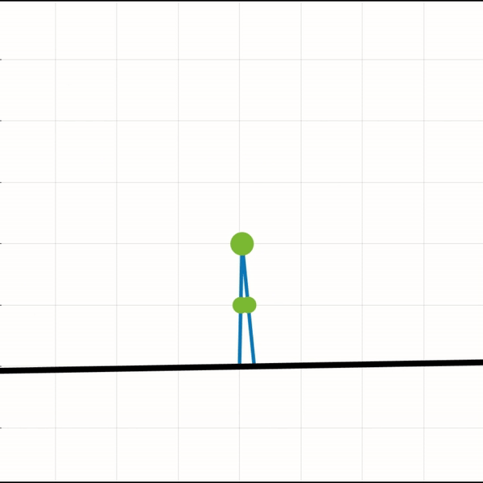

# Acrobot Control Methods

* Implementions of various control strategies for the acrobot (double pendulum model). Fully-actuated and underactuated cases are explored for the pinned model. Passive walking and Passivity-based control methods are also implemented for the floating base model walking at an incline. Relevant reference paper's are listed in the directories and scripts.

* Run the 'main.m' file in each directory and follow instructions.

*Passivity-based controller*

